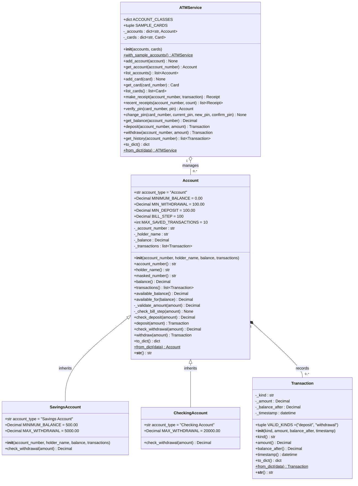

# ATM Simulator — UML Class Diagram

This document provides the Object-Oriented Programming (OOP) class diagram for the core banking classes in `atm_app/atm_classes.py`.

## Class Diagram

```mermaid
classDiagram
    direction TB

    class Account {
        +str account_type = "Account"
        +Decimal MINIMUM_BALANCE = 0.00
        +Decimal MIN_WITHDRAWAL = 100.00
        +Decimal MIN_DEPOSIT = 100.00
        +Decimal BILL_STEP = 100
        +int MAX_SAVED_TRANSACTIONS = 10
        -_account_number : str
        -_holder_name : str
        -_balance : Decimal
        -_transactions : list~Transaction~
        +__init__(account_number, holder_name, balance, transactions)
        +account_number() str
        +holder_name() str
        +masked_number() str
        +balance() Decimal
        +transactions() list~Transaction~
        +available_balance() Decimal
        +available_for(balance) Decimal
        -_validate_amount(amount) Decimal
        -_check_bill_step(amount) None
        +check_deposit(amount) Decimal
        +deposit(amount) Transaction
        +check_withdrawal(amount) Decimal
        +withdraw(amount) Transaction
        +to_dict() dict
        +from_dict(data)$ Account
        +__str__() str
    }

    class SavingsAccount {
        +str account_type = "Savings Account"
        +Decimal MINIMUM_BALANCE = 500.00
        +Decimal MAX_WITHDRAWAL = 5000.00
        +__init__(account_number, holder_name, balance, transactions)
        +check_withdrawal(amount) Decimal
    }

    class CheckingAccount {
        +str account_type = "Checking Account"
        +Decimal MAX_WITHDRAWAL = 20000.00
        +check_withdrawal(amount) Decimal
    }

    class Transaction {
        +tuple VALID_KINDS = ("deposit", "withdrawal")
        -_kind : str
        -_amount : Decimal
        -_balance_after : Decimal
        -_timestamp : datetime
        +__init__(kind, amount, balance_after, timestamp)
        +kind() str
        +amount() Decimal
        +balance_after() Decimal
        +timestamp() datetime
        +to_dict() dict
        +from_dict(data)$ Transaction
        +__str__() str
    }

    class ATMService {
        +dict ACCOUNT_CLASSES
        +tuple SAMPLE_CARDS
        -_accounts : dict~str, Account~
        -_cards : dict~str, Card~
        +__init__(accounts, cards)
        +with_sample_accounts()$ ATMService
        +add_account(account) None
        +get_account(account_number) Account
        +list_accounts() list~Account~
        +add_card(card) None
        +get_card(card_number) Card
        +list_cards() list~Card~
        +make_receipt(account_number, transaction) Receipt
        +recent_receipts(account_number, count) list~Receipt~
        +verify_pin(card_number, pin) Account
        +change_pin(card_number, current_pin, new_pin, confirm_pin) None
        +get_balance(account_number) Decimal
        +deposit(account_number, amount) Transaction
        +withdraw(account_number, amount) Transaction
        +get_history(account_number) list~Transaction~
        +to_dict() dict
        +from_dict(data)$ ATMService
    }

    Account <|-- SavingsAccount : inherits
    Account <|-- CheckingAccount : inherits
    Account "1" *-- "0..*" Transaction : records
    ATMService "1" o-- "0..*" Account : manages
```